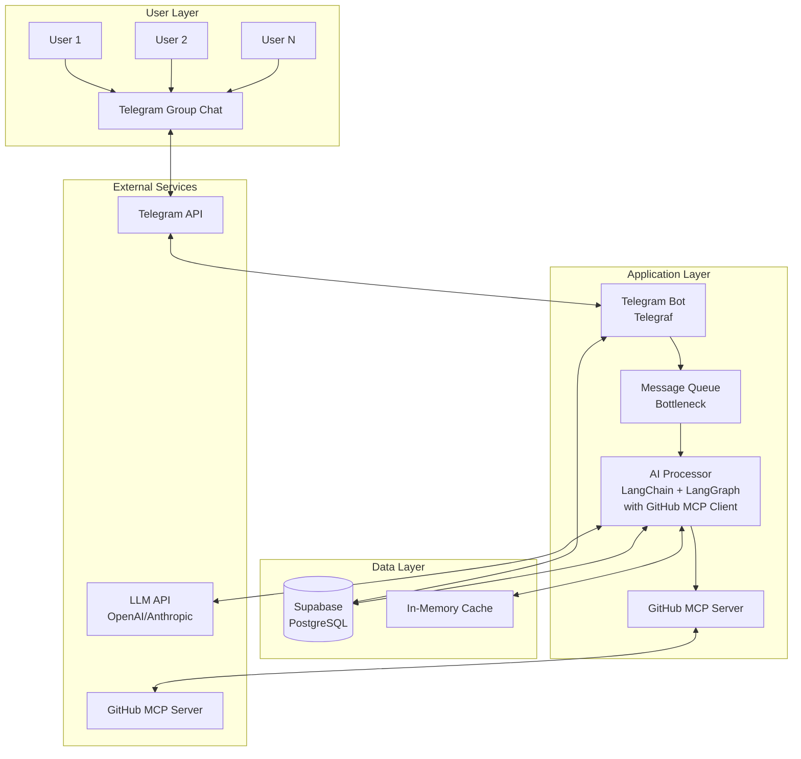

# TeleGit Product Requirements Document (PRD)
Version 1.0 | Date: November 2025

## Table of Contents
1. [Executive Summary](#executive-summary)
2. [System Architecture](#system-architecture)
3. [Core Components](#core-components)
4. [Data Models](#data-models)
5. [User Flows](#user-flows)
6. [API Specifications](#api-specifications)
7. [Security & Access Control](#security-access-control)
8. [Testing Strategy](#testing-strategy)
9. [Deployment & Infrastructure](#deployment-infrastructure)
10. [Monitoring & Observability](#monitoring-observability)

## Executive Summary

TeleGit is an AI-powered Telegram bot that transforms conversational messages into actionable GitHub issues through natural language processing. The system operates non-disruptively in team chat environments, using emoji reactions for status indication and temporary feedback messages that auto-delete to maintain chat cleanliness.

### Key Principles
- **Optimistic execution**: Performs actions without confirmation, allowing post-action correction
- **Non-disruptive UX**: Minimal chat pollution with auto-deleting feedback
- **Chat-first workflow**: Telegram as the single entry point for all operations
- **Extensible architecture**: Modular design for future integration targets beyond GitHub

### Technical Stack Overview
- **Runtime**: Node.js >= 24.0.0 with JavaScript (TypeScript for types only)
- **AI Orchestration**: LangChain.js + LangGraph
- **Message Queue**: Bottleneck (in-memory rate limiting)
- **Storage**: Supabase (PostgreSQL)
- **Testing**: Vitest + @faker-js/faker + Promptfoo
- **Deployment**: Docker + Dokploy
- **Integrations**: Telegraf (Telegram), GitHub MCP over HTTP

## System Architecture

### High-Level Architecture



### Component Communication Flow

```mermaid
sequenceDiagram
    participant User
    participant Telegram
    participant Bot
    participant Queue
    participant AI
    participant MCP
    participant GitHub
    participant Supabase
    
    User->>Telegram: Send message with #tag/@mention
    Telegram->>Bot: Webhook/Polling
    Bot->>Supabase: Check GitHub auth for chat
    alt No GitHub authentication
        Bot->>User: Trigger PAT setup workflow (see Auth Flow diagram)
        Note over Bot,User: Authentication must be completed first
    else GitHub authentication exists
        Bot->>Bot: Validate trigger conditions
        Bot->>Telegram: React with 👀 (Analyzing)
        Bot->>Queue: Enqueue processing job
        Queue->>AI: Process message (rate limited)
        AI->>Supabase: Get GitHub auth for chat
        AI->>AI: Configure GitHub MCP client with PAT
        AI->>AI: Extract intent & classify
        AI->>Telegram: Update reaction to 🤔 (Processing)
        AI->>MCP: Execute GitHub operation
        MCP->>GitHub: API call (create/update issue)
        GitHub-->>MCP: Response
        MCP-->>AI: Operation result
        AI->>Supabase: Store operation record
        AI->>Telegram: Final reaction (👾/🫡/🦄/😵‍💫)
        AI->>Telegram: Post feedback message
        Bot->>Bot: Schedule message deletion (10 min)
    end
```



### GitHub Authentication Flow


## Core Components

### 1. Telegram Bot Service (`/src/services/telegram`)

**Responsibilities:**
- WebHook/Polling management
- Message filtering and trigger detection
- Reaction management
- Feedback message lifecycle
- Group/user whitelisting

**Key Files:**
```javascript
// bot.js - Main bot initialization
import { Telegraf } from 'telegraf';
import { bottleneck } from '../queue/bottleneck.js';
import { processMessage } from '../ai/processor.js';

// handlers.js - Message handling logic
export const handleMessage = async (ctx) => {
  // Trigger detection: @mention or #hashtag
  if (!shouldProcess(ctx.message)) return;
  
  // Add analyzing reaction
  await ctx.react('👀');
  
  // Queue for processing
  await messageQueue.schedule(() => processMessage(ctx));
};

// reactions.js - Reaction-based controls
export const handleReaction = async (ctx) => {
  const { emoji, message_id } = ctx.update.reaction;
  
  switch(emoji) {
    case '👎': await undoLastAction(message_id); break;
    case '👍': await dismissFeedback(message_id); break;
  }
};
```

### 2. AI Processing Engine (`/src/ai`)

**Responsibilities:**
- Intent extraction and classification
- Context gathering (conversation threads)
- LangGraph workflow orchestration
- Tool execution coordination

**LangGraph Workflow:**


**Key Files:**
```javascript
// processor.js - Main AI processing
import { ChatOpenAI } from '@langchain/openai';
import { StateGraph } from '@langchain/langgraph';
import { githubTools } from '../tools/github.js';

// workflow.js - LangGraph workflow definition
export const createWorkflow = () => {
  const workflow = new StateGraph({
    channels: {
      messages: { value: [], reducer: (a, b) => [...a, ...b] },
      intent: { value: null },
      context: { value: {} },
      result: { value: null }
    }
  });
  
  workflow.addNode('analyze', analyzeIntent);
  workflow.addNode('search', searchIssues);
  workflow.addNode('create', createIssue);
  workflow.addNode('update', updateIssue);
  
  workflow.addConditionalEdges('analyze', routeByIntent);
  
  return workflow.compile();
};

// intents.js - Intent classification
const INTENT_SCHEMA = {
  type: 'object',
  properties: {
    intent: { 
      enum: ['create_bug', 'create_task', 'create_idea', 
              'update_issue', 'search_issues', 'unknown']
    },
    confidence: { type: 'number', min: 0, max: 1 },
    entities: {
      title: { type: 'string' },
      description: { type: 'string' },
      labels: { type: 'array', items: { type: 'string' } },
      assignees: { type: 'array', items: { type: 'string' } }
    }
  }
};
```

### 3. GitHub MCP Integration (`/src/integrations/github`)

**Responsibilities:**
- MCP server communication via LangChain MCP adapter
- Tool invocation and response handling
- Image attachment processing
- Error handling and retries

**Key Files:**
```javascript
// mcp-adapter.js - LangChain MCP adapter setup
import { wrapMCPServer } from '@langchain/mcp-adapters';
import { Client } from '@modelcontextprotocol/sdk/client/index.js';
import { SSEClientTransport } from '@modelcontextprotocol/sdk/client/sse.js';

export async function createGitHubMCPTools(config) {
  // Create MCP client with SSE transport
  const transport = new SSEClientTransport(
    new URL(config.mcpEndpoint)
  );

  const client = new Client({
    name: 'telegit-client',
    version: '1.0.0'
  }, {
    capabilities: {}
  });

  await client.connect(transport);

  // Wrap MCP server as LangChain tools using official adapter
  const tools = await wrapMCPServer({
    client,
    // Optional: filter specific tools
    includeTools: [
      'github_create_issue',
      'github_update_issue',
      'github_search_issues'
    ]
  });

  return tools;
}

// image-processor.js - Telegram image processing
export function processBodyWithImages(data) {
  // Convert Telegram image URLs to GitHub CDN
  return data.body.replace(
    /https:\/\/api\.telegram\.org\/file\/bot[^\/]+\/(.+)/g,
    (match, path) => uploadToGitHub(path)
  );
}
```

### 4. Rate Limiting Queue (`/src/queue`)

**Responsibilities:**
- API rate limit enforcement
- Priority queue management
- Retry logic with exponential backoff
- Concurrent operation control

**Configuration:**
```javascript
// bottleneck.js
import Bottleneck from 'bottleneck';

// Telegram rate limits
export const telegramLimiter = new Bottleneck({
  maxConcurrent: 1,
  minTime: 34, // ~30 msgs/sec
  reservoir: 30,
  reservoirRefreshAmount: 30,
  reservoirRefreshInterval: 1000
});

// GitHub rate limits (5000/hour = ~83/min)
export const githubLimiter = new Bottleneck({
  maxConcurrent: 2,
  minTime: 720, // ~83 requests/min
  reservoir: 100,
  reservoirRefreshAmount: 83,
  reservoirRefreshInterval: 60 * 1000
});

// LLM rate limits (vary by provider)
export const llmLimiter = new Bottleneck({
  maxConcurrent: 3,
  minTime: 200,
  reservoir: 50,
  reservoirRefreshAmount: 50,
  reservoirRefreshInterval: 60 * 1000
});
```

### 5. Data Persistence Layer (`/src/database`)

**Responsibilities:**
- Configuration storage
- Operation history
- User preferences
- Conversation context caching

**Key Files:**
```javascript
// supabase.js - Database client
import { createClient } from '@supabase/supabase-js';

export const supabase = createClient(
  process.env.SUPABASE_URL,
  process.env.SUPABASE_KEY
);

// repositories/config.js
export class ConfigRepository {
  async getGroupConfig(groupId) {
    const { data, error } = await supabase
      .from('group_configs')
      .select('*')
      .eq('telegram_group_id', groupId)
      .single();
    
    return data;
  }
  
  async setGroupConfig(groupId, config) {
    return supabase
      .from('group_configs')
      .upsert({
        telegram_group_id: groupId,
        github_repo: config.repo,
        github_token: this.encrypt(config.token),
        manager_user_id: config.managerId,
        updated_at: new Date().toISOString()
      });
  }
}
```

## Data Models

### Database Schema


### State Management

```javascript
// LangGraph State Schema
const WorkflowState = {
  // Input
  telegramMessage: {
    id: Number,
    text: String,
    from: Object,
    chat: Object,
    reply_to_message: Object,
    entities: Array
  },
  
  // Processing
  intent: {
    type: String,
    confidence: Number,
    entities: Object
  },
  
  conversationContext: Array, // Previous messages in thread
  
  // GitHub Operation
  githubOperation: {
    type: String, // 'create' | 'update' | 'search'
    repository: String,
    data: Object
  },
  
  // Result
  result: {
    success: Boolean,
    githubUrl: String,
    error: String
  },
  
  // Metadata
  timestamps: {
    received: Date,
    processed: Date,
    completed: Date
  }
};
```

## User Flows

### 1. Initial Bot Setup Flow


### 2. Message Processing Flow

```mermaid
flowchart TD
    Start([User sends message]) --> Check{Has trigger?}
    Check -->|No| Ignore[Ignore message]
    Check -->|Yes| React1[React: 👀]
    
    React1 --> CheckReply{Is reply?}
    CheckReply -->|Yes| Gather[Gather conversation thread]
    CheckReply -->|No| Process[Process single message]
    
    Gather --> Process
    Process --> AI[AI Analysis]
    AI --> React2[React: 🤔]
    
    AI --> IntentCheck{Intent recognized?}
    IntentCheck -->|No| Error[React: 😵‍💫]
    IntentCheck -->|Yes| Execute[Execute GitHub operation]
    
    Execute --> Success{Success?}
    Success -->|No| Error
    Success -->|Yes| Final[React: 👾/🫡/🦄]
    
    Final --> Feedback[Post feedback message]
    Feedback --> Timer[Start 10-min timer]
    Timer --> Delete[Auto-delete feedback]
    
    Error --> ErrorMsg[Post error message]
    ErrorMsg --> Timer
    
    Ignore --> End([End])
    Delete --> End
```



### 3. Reaction Control Flow

```mermaid
flowchart LR
    User[User] --> React{Reaction type?}
    React -->|👎 on feedback| Undo[Undo last operation]
    React -->|👍 on feedback| Dismiss[Delete feedback immediately]
    
    Undo --> FindOp[Find operation record]
    FindOp --> Revert[Revert GitHub action]
    Revert --> Update[Update feedback message]
    
    Dismiss --> Delete[Delete feedback message]
    Delete --> Clear[Clear deletion timer]
```



## API Specifications

### Telegram Webhook

```javascript
// POST /webhook/telegram
{
  update_id: Number,
  message: {
    message_id: Number,
    from: { id: Number, username: String },
    chat: { id: Number, type: String },
    date: Number,
    text: String,
    entities: Array,
    reply_to_message: Object
  }
}

// Response
{
  status: 'processed' | 'ignored',
  trigger: String // What triggered processing
}
```

### Internal API Endpoints

```javascript
// GET /api/health
Response: { 
  status: 'healthy', 
  version: String,
  uptime: Number,
  services: {
    telegram: Boolean,
    github: Boolean,
    supabase: Boolean,
    llm: Boolean
  }
}

// POST /api/admin/configure
Request: {
  groupId: String,
  githubToken: String,
  repository: String
}
Response: {
  success: Boolean,
  message: String
}

// GET /api/stats/:groupId
Response: {
  totalOperations: Number,
  operationsByType: Object,
  last24Hours: Array,
  topUsers: Array
}
```

### GitHub MCP Tool Schemas

```javascript
// create_issue tool
{
  name: 'github_create_issue',
  parameters: {
    repository: String, // "owner/repo"
    title: String,
    body: String,
    labels: [String],
    assignees: [String],
    milestone: Number
  }
}

// update_issue tool
{
  name: 'github_update_issue',
  parameters: {
    repository: String,
    issue_number: Number,
    title: String,
    body: String,
    state: 'open' | 'closed',
    labels: [String],
    assignees: [String]
  }
}

// search_issues tool
{
  name: 'github_search_issues',
  parameters: {
    repository: String,
    query: String, // GitHub search syntax
    sort: 'created' | 'updated' | 'comments',
    order: 'asc' | 'desc',
    per_page: Number,
    page: Number
  }
}
```

## Security & Access Control

### Authentication Flow


### Security Measures

1. **Token Management**
   - GitHub PATs encrypted at rest (AES-256-GCM)
   - Tokens never logged or exposed in responses
   - Automatic token rotation reminders

2. **Access Control**
   - Whitelist-based group/user filtering
   - Manager-only configuration changes
   - Rate limiting per user and group

3. **Input Validation**
   - Sanitize all Telegram input
   - Validate GitHub API responses
   - LLM output validation against schemas

4. **Network Security**
   - HTTPS only for webhooks
   - Webhook signature verification
   - IP whitelisting for production

## Testing Strategy

### Unit Testing Structure

```javascript
// test/unit/ai/intent-classifier.test.js
import { describe, it, expect, vi } from 'vitest';
import { classifyIntent } from '../../../src/ai/intent-classifier.js';

describe('Intent Classifier', () => {
  it('should identify bug report with high confidence', async () => {
    const message = 'Found a bug: login button not working #bug';
    const result = await classifyIntent(message);
    
    expect(result.intent).toBe('create_bug');
    expect(result.confidence).toBeGreaterThan(0.8);
    expect(result.entities.labels).toContain('bug');
  });
});
```

### LLM Evaluation with Promptfoo

```yaml
# promptfoo.config.yaml
providers:
  - openai:gpt-4
  - anthropic:claude-3

prompts:
  - file://prompts/intent-classification.txt

tests:
  - description: Bug report detection
    vars:
      message: "The API returns 500 errors when filtering by date #bug"
    assert:
      - type: javascript
        value: output.intent === 'create_bug'
      - type: llm-rubric
        value: "The intent should be classified as bug with high confidence"
        
  - description: Task creation
    vars:
      message: "Need to implement user authentication #todo"
    assert:
      - type: javascript
        value: output.intent === 'create_task'
      - type: llm-rubric
        value: "Task should be identified with relevant technical details"
```

### Integration Testing

```javascript
// test/integration/telegram-github-flow.test.js
import { describe, it, expect, beforeAll, afterAll } from 'vitest';
import { faker } from '@faker-js/faker';
import { createTestBot } from '../helpers/bot.js';
import { mockTelegramMessage } from '../mocks/telegram.js';

describe('Telegram to GitHub Flow', () => {
  let bot, mockGroup;
  
  beforeAll(async () => {
    bot = await createTestBot();
    mockGroup = {
      id: faker.number.int({ min: -1000000000000 }),
      title: faker.company.name()
    };
  });
  
  it('should create GitHub issue from bug report', async () => {
    const message = mockTelegramMessage({
      text: `${faker.lorem.sentence()} #bug`,
      chat: mockGroup
    });
    
    const result = await bot.processMessage(message);
    
    expect(result.reactions).toContain('👾');
    expect(result.githubUrl).toMatch(/github\.com\/.*\/issues\/\d+/);
    expect(result.feedbackMessage).toBeDefined();
  });
});
```

## Deployment & Infrastructure

### Docker Configuration

```dockerfile
# Dockerfile
FROM node:24-alpine

WORKDIR /app

# Install dependencies
COPY package*.json ./
RUN npm ci --only=production

# Copy source
COPY src ./src
COPY config ./config

# Health check
HEALTHCHECK --interval=30s --timeout=3s --start-period=5s \
  CMD node healthcheck.js

# Start
CMD ["node", "src/index.js"]
```

### Docker Compose

```yaml
# docker-compose.yml
version: '3.8'

services:
  telegit:
    build: .
    environment:
      NODE_ENV: production
      TELEGRAM_BOT_TOKEN: ${TELEGRAM_BOT_TOKEN}
      SUPABASE_URL: ${SUPABASE_URL}
      SUPABASE_KEY: ${SUPABASE_KEY}
      LLM_API_KEY: ${LLM_API_KEY}
      MCP_GITHUB_ENDPOINT: ${MCP_GITHUB_ENDPOINT}
    ports:
      - "3000:3000"
    restart: unless-stopped
    depends_on:
      - redis
    networks:
      - telegit-network
    
  redis:
    image: redis:7-alpine
    volumes:
      - redis-data:/data
    networks:
      - telegit-network

volumes:
  redis-data:

networks:
  telegit-network:
    driver: bridge
```

### Dokploy Deployment

```yaml
# dokploy.yaml
name: telegit
type: docker
dockerfile: ./Dockerfile

environment:
  - NODE_ENV=production
  - PORT=3000

secrets:
  - TELEGRAM_BOT_TOKEN
  - SUPABASE_URL
  - SUPABASE_KEY
  - LLM_API_KEY
  - ENCRYPTION_KEY

healthcheck:
  path: /api/health
  interval: 30s
  timeout: 10s

resources:
  memory: 512MB
  cpu: 0.5

autoscaling:
  min: 1
  max: 3
  target_cpu: 70

domains:
  - domain: telegit.yourdomain.com
    ssl: true

monitoring:
  enabled: true
  metrics_path: /metrics
```

### Kubernetes Deployment

```yaml
# k8s/namespace.yaml
apiVersion: v1
kind: Namespace
metadata:
  name: telegit
  labels:
    app: telegit
---
# k8s/configmap.yaml
apiVersion: v1
kind: ConfigMap
metadata:
  name: telegit-config
  namespace: telegit
data:
  NODE_ENV: "production"
  LOG_LEVEL: "info"
  PORT: "3000"
---
# k8s/secret.yaml
apiVersion: v1
kind: Secret
metadata:
  name: telegit-secrets
  namespace: telegit
type: Opaque
stringData:
  TELEGRAM_BOT_TOKEN: "" # Set via kubectl or external secrets operator
  SUPABASE_URL: ""
  SUPABASE_KEY: ""
  LLM_API_KEY: ""
  ENCRYPTION_KEY: ""
  TELEGRAM_WEBHOOK_SECRET: ""
---
# k8s/deployment.yaml
apiVersion: apps/v1
kind: Deployment
metadata:
  name: telegit
  namespace: telegit
  labels:
    app: telegit
spec:
  replicas: 2
  selector:
    matchLabels:
      app: telegit
  template:
    metadata:
      labels:
        app: telegit
    spec:
      containers:
      - name: telegit
        image: telegit:latest
        imagePullPolicy: Always
        ports:
        - containerPort: 3000
          name: http
        envFrom:
        - configMapRef:
            name: telegit-config
        - secretRef:
            name: telegit-secrets
        resources:
          requests:
            memory: "256Mi"
            cpu: "250m"
          limits:
            memory: "512Mi"
            cpu: "500m"
        livenessProbe:
          httpGet:
            path: /api/health
            port: 3000
          initialDelaySeconds: 30
          periodSeconds: 30
          timeoutSeconds: 10
        readinessProbe:
          httpGet:
            path: /api/health
            port: 3000
          initialDelaySeconds: 5
          periodSeconds: 10
          timeoutSeconds: 5
---
# k8s/service.yaml
apiVersion: v1
kind: Service
metadata:
  name: telegit
  namespace: telegit
  labels:
    app: telegit
spec:
  type: ClusterIP
  ports:
  - port: 80
    targetPort: 3000
    protocol: TCP
    name: http
  selector:
    app: telegit
---
# k8s/ingress.yaml
apiVersion: networking.k8s.io/v1
kind: Ingress
metadata:
  name: telegit
  namespace: telegit
  annotations:
    cert-manager.io/cluster-issuer: "letsencrypt-prod"
    nginx.ingress.kubernetes.io/ssl-redirect: "true"
spec:
  ingressClassName: nginx
  tls:
  - hosts:
    - telegit.yourdomain.com
    secretName: telegit-tls
  rules:
  - host: telegit.yourdomain.com
    http:
      paths:
      - path: /
        pathType: Prefix
        backend:
          service:
            name: telegit
            port:
              number: 80
---
# k8s/hpa.yaml
apiVersion: autoscaling/v2
kind: HorizontalPodAutoscaler
metadata:
  name: telegit
  namespace: telegit
spec:
  scaleTargetRef:
    apiVersion: apps/v1
    kind: Deployment
    name: telegit
  minReplicas: 2
  maxReplicas: 5
  metrics:
  - type: Resource
    resource:
      name: cpu
      target:
        type: Utilization
        averageUtilization: 70
  - type: Resource
    resource:
      name: memory
      target:
        type: Utilization
        averageUtilization: 80
---
# k8s/pdb.yaml
apiVersion: policy/v1
kind: PodDisruptionBudget
metadata:
  name: telegit
  namespace: telegit
spec:
  minAvailable: 1
  selector:
    matchLabels:
      app: telegit
```

### Environment Configuration

```bash
# .env.production
NODE_ENV=production
LOG_LEVEL=info

# Telegram
TELEGRAM_BOT_TOKEN=bot_token_here
TELEGRAM_WEBHOOK_URL=https://telegit.yourdomain.com/webhook/telegram
TELEGRAM_WEBHOOK_SECRET=random_secret_here

# Supabase
SUPABASE_URL=https://xxxxx.supabase.co
SUPABASE_KEY=service_role_key_here

# LLM Provider
LLM_PROVIDER=openai
LLM_API_KEY=sk-xxxxx
LLM_MODEL=gpt-4-turbo

# GitHub MCP
MCP_GITHUB_ENDPOINT=http://mcp-server:8080
MCP_TIMEOUT=30000

# Security
ENCRYPTION_KEY=32_byte_hex_key
ALLOWED_GROUPS=-1001234567890,-1009876543210
ALLOWED_USERS=123456789,987654321

# Rate Limits
RATE_LIMIT_TELEGRAM_PER_SECOND=30
RATE_LIMIT_GITHUB_PER_HOUR=5000
RATE_LIMIT_LLM_PER_MINUTE=50
```

## Monitoring & Observability

### Metrics Collection

```javascript
// src/monitoring/metrics.js
import { register, Counter, Histogram, Gauge } from 'prom-client';

export const metrics = {
  messagesProcessed: new Counter({
    name: 'telegit_messages_processed_total',
    help: 'Total messages processed',
    labelNames: ['group_id', 'intent_type', 'status']
  }),
  
  processingDuration: new Histogram({
    name: 'telegit_processing_duration_seconds',
    help: 'Message processing duration',
    labelNames: ['operation'],
    buckets: [0.1, 0.5, 1, 2, 5, 10]
  }),
  
  activeOperations: new Gauge({
    name: 'telegit_active_operations',
    help: 'Currently active operations',
    labelNames: ['type']
  }),
  
  githubApiCalls: new Counter({
    name: 'telegit_github_api_calls_total',
    help: 'GitHub API calls',
    labelNames: ['operation', 'status']
  }),
  
  llmTokensUsed: new Counter({
    name: 'telegit_llm_tokens_total',
    help: 'LLM tokens consumed',
    labelNames: ['model', 'operation']
  })
};
```

### Logging Strategy

```javascript
// src/utils/logger.js
import winston from 'winston';

export const logger = winston.createLogger({
  level: process.env.LOG_LEVEL || 'info',
  format: winston.format.combine(
    winston.format.timestamp(),
    winston.format.errors({ stack: true }),
    winston.format.json()
  ),
  defaultMeta: { 
    service: 'telegit',
    version: process.env.npm_package_version 
  },
  transports: [
    new winston.transports.Console({
      format: winston.format.simple()
    })
  ]
});

// Structured logging example
logger.info('Message processed', {
  groupId: message.chat.id,
  userId: message.from.id,
  intent: result.intent,
  confidence: result.confidence,
  githubIssue: result.issueNumber,
  processingTime: endTime - startTime
});
```

### Health Monitoring


### Alert Configuration

```javascript
// src/monitoring/alerts.js
export const alertRules = {
  highErrorRate: {
    condition: 'rate(telegit_messages_processed_total{status="error"}[5m]) > 0.1',
    severity: 'warning',
    message: 'Error rate exceeds 10% in last 5 minutes'
  },
  
  slowProcessing: {
    condition: 'histogram_quantile(0.95, telegit_processing_duration_seconds) > 10',
    severity: 'warning',
    message: '95th percentile processing time exceeds 10 seconds'
  },
  
  githubRateLimit: {
    condition: 'telegit_github_rate_limit_remaining < 100',
    severity: 'critical',
    message: 'GitHub API rate limit nearly exhausted'
  },
  
  llmTimeout: {
    condition: 'rate(telegit_llm_timeouts_total[5m]) > 5',
    severity: 'warning',
    message: 'Multiple LLM API timeouts detected'
  },
  
  queueBacklog: {
    condition: 'telegit_queue_size > 100',
    severity: 'warning',
    message: 'Message queue backlog growing'
  }
};
```

## Performance Optimization

### Caching Strategy

```javascript
// src/cache/strategy.js
const cacheConfig = {
  conversationContext: {
    ttl: 3600, // 1 hour
    maxSize: 1000 // entries
  },
  
  githubIssues: {
    ttl: 300, // 5 minutes
    maxSize: 500
  },
  
  userPreferences: {
    ttl: 86400, // 24 hours
    maxSize: 10000
  },
  
  llmResponses: {
    ttl: 1800, // 30 minutes for similar queries
    maxSize: 100
  }
};
```

### Optimization Techniques

1. **Message Batching**: Group multiple operations for bulk processing
2. **Lazy Loading**: Load conversation context only when needed
3. **Connection Pooling**: Reuse database and HTTP connections
4. **Response Streaming**: Stream LLM responses for faster feedback
5. **Predictive Caching**: Pre-cache likely GitHub searches

## Error Handling

### Error Recovery Flow


### Error Messages

```javascript
const errorMessages = {
  RATE_LIMIT: "⏳ Taking a breather - too many requests. Will retry shortly.",
  GITHUB_AUTH: "🔐 GitHub authentication issue. Please check your PAT with /configure",
  LLM_TIMEOUT: "🤔 AI is thinking too hard. Let me try again...",
  INTENT_UNCLEAR: "😕 I didn't quite understand that. Could you rephrase?",
  NETWORK_ERROR: "📡 Connection issues. Retrying...",
  INVALID_REPO: "❌ Can't access the GitHub repository. Please check configuration.",
  PERMISSION_DENIED: "🚫 You don't have permission for this operation."
};
```

## Extensibility Design

### Plugin Architecture

```javascript
// src/plugins/base.js
export class IntegrationPlugin {
  constructor(config) {
    this.name = this.constructor.name;
    this.config = config;
  }
  
  // Required methods
  async initialize() { throw new Error('Not implemented'); }
  async createItem(data) { throw new Error('Not implemented'); }
  async updateItem(id, data) { throw new Error('Not implemented'); }
  async searchItems(query) { throw new Error('Not implemented'); }
  async deleteItem(id) { throw new Error('Not implemented'); }
  
  // Lifecycle hooks
  async beforeCreate(data) { return data; }
  async afterCreate(result) { return result; }
  async onError(error) { throw error; }
}

// Example: Future Jira plugin
export class JiraPlugin extends IntegrationPlugin {
  async initialize() {
    this.client = new JiraClient(this.config);
    await this.client.authenticate();
  }
  
  async createItem(data) {
    const issue = await this.beforeCreate(data);
    const result = await this.client.createIssue({
      project: this.config.project,
      summary: issue.title,
      description: issue.body,
      issueType: this.mapIntentToIssueType(issue.intent)
    });
    return this.afterCreate(result);
  }
}
```

## Conclusion

TeleGit represents a production-ready architecture for AI-powered chat-to-task-management integration. The system leverages mature technologies (LangChain.js, Bottleneck, Supabase) while maintaining extensibility for future enhancements. The modular design, comprehensive testing strategy, and robust error handling ensure reliable operation at scale.

### Key Success Factors
1. **Non-disruptive UX** through emoji reactions and auto-deleting messages
2. **Optimistic execution** with post-action correction capabilities
3. **Extensible architecture** ready for additional integrations
4. **Production-grade infrastructure** with monitoring and observability
5. **Comprehensive testing** including LLM evaluation framework

### Next Steps
1. Implement core components following the architecture
2. Set up CI/CD pipeline with automated testing
3. Deploy MVP to staging environment
4. Conduct user acceptance testing
5. Progressive rollout to production groups
6. Monitor metrics and iterate based on feedback
