# TeleGit Product Requirements Document (PRD)
Version 1.0 | Date: November 2025

## Table of Contents
1. [Executive Summary](#executive-summary)
2. [System Architecture](#system-architecture)
3. [Core Components](#core-components)
4. [Data Models](#data-models)
5. [User Flows](#user-flows)
6. [API Specifications](#api-specifications)
7. [Security & Access Control](#security-access-control)
8. [Message Template System](#message-template-system)
9. [Testing Strategy](#testing-strategy)
10. [Deployment & Infrastructure](#deployment-infrastructure)
11. [Monitoring & Observability](#monitoring-observability)

## Executive Summary

TeleGit is an AI-powered Telegram bot that transforms conversational messages into actionable GitHub issues through natural language processing. The system operates non-disruptively in team chat environments, using emoji reactions for status indication and temporary feedback messages that auto-delete to maintain chat cleanliness.

### Key Principles
- **Optimistic execution**: Performs actions without confirmation, allowing post-action correction
- **Non-disruptive UX**: Minimal chat pollution with auto-deleting feedback
- **Chat-first workflow**: Telegram as the single entry point for all operations
- **Extensible architecture**: Modular design for future integration targets beyond GitHub

### Technical Stack Overview
- **Runtime**: Node.js >= 22.0.0 (LTS) with JavaScript (prefer `*.d.ts` files for type definitions over JSDoc)
- **AI Orchestration**: LangChain.js + LangGraph
- **Message Queue**: Bottleneck (in-memory rate limiting)
- **Storage**: PostgreSQL
- **Testing**: Vitest + @faker-js/faker + Promptfoo
- **Deployment**: Docker + Dokploy
- **Integrations**: Telegraf (Telegram), GitHub MCP over HTTP

## System Architecture

### High-Level Architecture


### Component Communication Flow

```mermaid
sequenceDiagram
    participant User
    participant Telegram
    participant Bot
    participant Queue
    participant AI
    participant MCP
    participant GitHub
    participant PostgreSQL
    
    User->>Telegram: Send message with #tag/@mention
    Telegram->>Bot: Webhook/Polling
    Bot->>PostgreSQL: Check GitHub auth for chat
    alt No GitHub authentication
        Bot->>User: Trigger PAT setup workflow (see Auth Flow diagram)
        Note over Bot,User: Authentication must be completed first
    else GitHub authentication exists
        Bot->>Bot: Validate trigger conditions
        Bot->>Telegram: React with 👀 (Analyzing)
        Bot->>Queue: Enqueue processing job
        Queue->>AI: Process message (rate limited)
        AI->>PostgreSQL: Get GitHub auth for chat
        AI->>AI: Configure GitHub MCP client with PAT
        AI->>AI: Extract intent & classify
        AI->>Telegram: Update reaction to 🤔 (Processing)
        AI->>MCP: Execute GitHub operation
        MCP->>GitHub: API call (create/update issue)
        GitHub-->>MCP: Response
        MCP-->>AI: Operation result
        AI->>PostgreSQL: Store operation record
        AI->>Telegram: Final reaction (👾/🫡/🦄/😵‍💫)
        AI->>Telegram: Post feedback message
        Bot->>Bot: Schedule message deletion (10 min)
    end
```



### GitHub Authentication Flow


## Core Components

### 1. Telegram Bot Service (`/src/services/telegram`)

**Responsibilities:**
- WebHook/Polling management
- Message filtering and trigger detection
- Reaction management
- Feedback message lifecycle
- Group/user whitelisting

**Key Files:**
```javascript
// bot.js - Main bot initialization
import { Telegraf } from 'telegraf';
import { bottleneck } from '../queue/bottleneck.js';
import { processMessage } from '../ai/processor.js';

// handlers.js - Message handling logic
export const handleMessage = async (ctx) => {
  // Trigger detection: @mention or #hashtag
  if (!shouldProcess(ctx.message)) return;
  
  // Add analyzing reaction
  await ctx.react('👀');
  
  // Queue for processing
  await messageQueue.schedule(() => processMessage(ctx));
};

// reactions.js - Reaction-based controls
export const handleReaction = async (ctx) => {
  const { emoji, message_id } = ctx.update.reaction;
  
  switch(emoji) {
    case '👎': await undoLastAction(message_id); break;
    case '👍': await dismissFeedback(message_id); break;
  }
};
```

### 2. AI Processing Engine (`/src/ai`)

**Responsibilities:**
- Intent extraction and classification
- Context gathering (conversation threads)
- LangGraph workflow orchestration
- Tool execution coordination

**LangGraph Workflow:**


**Key Files:**
```javascript
// processor.js - Main AI processing
import { ChatOpenAI } from '@langchain/openai';
import { StateGraph } from '@langchain/langgraph';
import { githubTools } from '../tools/github.js';

// workflow.js - LangGraph workflow definition
export const createWorkflow = () => {
  const workflow = new StateGraph({
    channels: {
      messages: { value: [], reducer: (a, b) => [...a, ...b] },
      intent: { value: null },
      context: { value: {} },
      result: { value: null }
    }
  });
  
  workflow.addNode('analyze', analyzeIntent);
  workflow.addNode('search', searchIssues);
  workflow.addNode('create', createIssue);
  workflow.addNode('update', updateIssue);
  
  workflow.addConditionalEdges('analyze', routeByIntent);
  
  return workflow.compile();
};

// intents.js - Intent classification
const INTENT_SCHEMA = {
  type: 'object',
  properties: {
    intent: { 
      enum: ['create_bug', 'create_task', 'create_idea', 
              'update_issue', 'search_issues', 'unknown']
    },
    confidence: { type: 'number', min: 0, max: 1 },
    entities: {
      title: { type: 'string' },
      description: { type: 'string' },
      labels: { type: 'array', items: { type: 'string' } },
      assignees: { type: 'array', items: { type: 'string' } }
    }
  }
};
```

### 3. GitHub MCP Integration (`/src/integrations/github`)

**Responsibilities:**
- MCP server communication via LangChain MCP adapter
- Tool invocation and response handling
- Image attachment processing
- Error handling and retries

**Key Files:**
```javascript
// mcp-adapter.js - LangChain MCP adapter setup
import { wrapMCPServer } from '@langchain/mcp-adapters';
import { Client } from '@modelcontextprotocol/sdk/client/index.js';
import { SSEClientTransport } from '@modelcontextprotocol/sdk/client/sse.js';

export async function createGitHubMCPTools(config) {
  // Create MCP client with SSE transport
  const transport = new SSEClientTransport(
    new URL(config.mcpEndpoint)
  );

  const client = new Client({
    name: 'telegit-client',
    version: '1.0.0'
  }, {
    capabilities: {}
  });

  await client.connect(transport);

  // Wrap MCP server as LangChain tools using official adapter
  const tools = await wrapMCPServer({
    client,
    // Optional: filter specific tools
    includeTools: [
      'github_create_issue',
      'github_update_issue',
      'github_search_issues'
    ]
  });

  return tools;
}

// image-processor.js - Telegram image processing
export function processBodyWithImages(data) {
  // Convert Telegram image URLs to GitHub CDN
  return data.body.replace(
    /https:\/\/api\.telegram\.org\/file\/bot[^\/]+\/(.+)/g,
    (match, path) => uploadToGitHub(path)
  );
}
```

### 4. Rate Limiting Queue (`/src/queue`)

**Responsibilities:**
- API rate limit enforcement
- Priority queue management
- Retry logic with exponential backoff
- Concurrent operation control

**Configuration:**
```javascript
// bottleneck.js
import Bottleneck from 'bottleneck';

// Telegram rate limits
export const telegramLimiter = new Bottleneck({
  maxConcurrent: 1,
  minTime: 34, // ~30 msgs/sec
  reservoir: 30,
  reservoirRefreshAmount: 30,
  reservoirRefreshInterval: 1000
});

// GitHub rate limits (5000/hour = ~83/min)
export const githubLimiter = new Bottleneck({
  maxConcurrent: 2,
  minTime: 720, // ~83 requests/min
  reservoir: 100,
  reservoirRefreshAmount: 83,
  reservoirRefreshInterval: 60 * 1000
});

// LLM rate limits (vary by provider)
export const llmLimiter = new Bottleneck({
  maxConcurrent: 3,
  minTime: 200,
  reservoir: 50,
  reservoirRefreshAmount: 50,
  reservoirRefreshInterval: 60 * 1000
});
```

### 5. Data Persistence Layer (`/src/database`)

**Responsibilities:**
- Configuration storage
- Operation history
- User preferences
- Conversation context caching

**Key Files:**
```javascript
// db.js - Database client
import pg from 'pg';
const { Pool } = pg;

export const pool = new Pool({
  host: process.env.POSTGRES_HOST,
  port: process.env.POSTGRES_PORT,
  database: process.env.POSTGRES_DB,
  user: process.env.POSTGRES_USER,
  password: process.env.POSTGRES_PASSWORD,
  max: 20,
  idleTimeoutMillis: 30000,
  connectionTimeoutMillis: 2000,
});

// repositories/config.js
export class ConfigRepository {
  async getGroupConfig(groupId) {
    const result = await pool.query(
      'SELECT * FROM group_configs WHERE telegram_group_id = $1',
      [groupId]
    );

    return result.rows[0];
  }

  async setGroupConfig(groupId, config) {
    return pool.query(
      `INSERT INTO group_configs (telegram_group_id, github_repo, github_token, manager_user_id, updated_at)
       VALUES ($1, $2, $3, $4, $5)
       ON CONFLICT (telegram_group_id)
       DO UPDATE SET
         github_repo = EXCLUDED.github_repo,
         github_token = EXCLUDED.github_token,
         manager_user_id = EXCLUDED.manager_user_id,
         updated_at = EXCLUDED.updated_at`,
      [groupId, config.repo, this.encrypt(config.token), config.managerId, new Date().toISOString()]
    );
  }
}
```

## Data Models

### Database Schema


### State Management

```javascript
// LangGraph State Schema
const WorkflowState = {
  // Input
  telegramMessage: {
    id: Number,
    text: String,
    from: Object,
    chat: Object,
    reply_to_message: Object,
    entities: Array
  },
  
  // Processing
  intent: {
    type: String,
    confidence: Number,
    entities: Object
  },
  
  conversationContext: Array, // Previous messages in thread
  
  // GitHub Operation
  githubOperation: {
    type: String, // 'create' | 'update' | 'search'
    repository: String,
    data: Object
  },
  
  // Result
  result: {
    success: Boolean,
    githubUrl: String,
    error: String
  },
  
  // Metadata
  timestamps: {
    received: Date,
    processed: Date,
    completed: Date
  }
};
```

## User Flows

### 1. Initial Bot Setup Flow


### 2. Message Processing Flow

```mermaid
flowchart TD
    Start([User sends message]) --> Check{Has trigger?}
    Check -->|No| Ignore[Ignore message]
    Check -->|Yes| React1[React: 👀]
    
    React1 --> CheckReply{Is reply?}
    CheckReply -->|Yes| Gather[Gather conversation thread]
    CheckReply -->|No| Process[Process single message]
    
    Gather --> Process
    Process --> AI[AI Analysis]
    AI --> React2[React: 🤔]
    
    AI --> IntentCheck{Intent recognized?}
    IntentCheck -->|No| Error[React: 😵‍💫]
    IntentCheck -->|Yes| Execute[Execute GitHub operation]
    
    Execute --> Success{Success?}
    Success -->|No| Error
    Success -->|Yes| Final[React: 👾/🫡/🦄]
    
    Final --> Feedback[Post feedback message as reply]
    Feedback --> Timer[Start 10-min timer]
    Timer --> Delete[Auto-delete feedback]
    
    Error --> ErrorMsg[Post error message]
    ErrorMsg --> Timer
    
    Ignore --> End([End])
    Delete --> End
```



### 3. Reaction Control Flow

```mermaid
flowchart LR
    User[User] --> React{Reaction type?}
    React -->|👎 on feedback| Undo[Undo operation associated with this feedback]
    React -->|👍 on feedback| Dismiss[Delete feedback immediately]

    Undo --> FindOp[Find operation record by feedback message]
    FindOp --> Revert[Revert GitHub action]
    Revert --> Update[Update feedback message]

    Dismiss --> Delete[Delete feedback message]
    Delete --> Clear[Clear deletion timer]
```



## API Specifications

### Telegram Webhook

Webhook handling is managed internally by Telegraf library. The bot listens for updates and processes them according to configured handlers.

### Internal API Endpoints

```javascript
// GET /api/health
Response: {
  status: 'healthy',
  version: String,
  uptime: Number,
  services: {
    telegram: Boolean,
    github: Boolean,
    postgresql: Boolean,
    llm: Boolean
  }
}
```

### Image Upload Proxy Endpoint

For security reasons, Telegram asset URLs contain bot tokens and cannot be passed directly to GitHub. A proxy endpoint is required:

```javascript
// GET /api/telegram-asset/:filePath
// Internal endpoint that:
// 1. Accepts the file path from Telegram
// 2. Constructs the full URL: https://api.telegram.org/file/bot${TELEGRAM_BOT_API_TOKEN}/${filePath}
// 3. Fetches the asset from Telegram servers
// 4. Streams the asset data to the client (GitHub MCP)
// This keeps the bot token secure on the backend
```

### GitHub MCP Tool Schemas

```javascript
// create_issue tool
{
  name: 'github_create_issue',
  parameters: {
    repository: String, // "owner/repo"
    title: String,
    body: String,
    labels: [String],
    assignees: [String],
    milestone: Number
  }
}

// update_issue tool
{
  name: 'github_update_issue',
  parameters: {
    repository: String,
    issue_number: Number,
    title: String,
    body: String,
    state: 'open' | 'closed',
    labels: [String],
    assignees: [String]
  }
}

// search_issues tool
{
  name: 'github_search_issues',
  parameters: {
    repository: String,
    query: String, // GitHub search syntax
    sort: 'created' | 'updated' | 'comments',
    order: 'asc' | 'desc',
    per_page: Number,
    page: Number
  }
}
```

## Security & Access Control

### Security Measures

1. **Token Management**
   - GitHub PATs encrypted at rest (AES-256-GCM)
   - Tokens never logged or exposed in responses

2. **Access Control**
   - Whitelisted Telegram accounts and groups defined via environment variables (ALLOWED_GROUPS, ALLOWED_USERS)
   - Rate limiting per user and group

3. **Input Validation**
   - Sanitize all Telegram input
   - Validate GitHub API responses
   - LLM output validation against schemas

4. **Network Security**
   - HTTPS only for webhooks
   - Webhook signature verification
   - IP whitelisting for production

## Message Template System

TeleGit uses **i18next** for message template management, providing clean code separation, easy message editing, and future i18n support. This is the industry-standard approach used by major frameworks and widely adopted in the Node.js ecosystem.

### Architecture Overview

#### Why i18next?

i18next is the industry standard for JavaScript internationalization with:
- **Wide Adoption**: Used by React, Vue.js, Angular, Express.js, and thousands of projects
- **Mature Ecosystem**: 10+ years of development, extensive documentation
- **Simple JSON Format**: Easy to edit without programming knowledge
- **Rich Features**: Interpolation, pluralization, context, nesting
- **Framework Agnostic**: Works with any JavaScript runtime
- **Migration Path**: Start simple, add i18n features later without refactoring

#### Design Principles

1. **Separation of Concerns**: Messages separated from business logic
2. **Easy Editing**: Non-developers can edit messages without touching code
3. **Type Safety**: TypeScript definitions for message keys
4. **Performance**: Messages loaded once at startup, cached in memory
5. **Future-Proof**: i18n-ready architecture without complexity overhead

### Directory Structure

```
locales/
├── en/                          # Default language (English)
│   ├── messages.json           # User-facing bot messages
│   ├── errors.json             # Error messages
│   ├── auth.json               # Authentication flow messages
│   ├── feedback.json           # Feedback message templates
│   ├── reactions.json          # Reaction emoji mappings
│   └── prompts.json            # LLM prompt templates
├── es/                          # Spanish (future)
│   └── ...
└── fr/                          # French (future)
    └── ...
```

### Message File Structure

#### messages.json - User-Facing Bot Messages

```json
{
  "welcome": {
    "group_added": "👋 Hi! I'm TeleGit. I'll help you create GitHub issues from your conversations.\n\nTo get started, the group admin should run /start",
    "dm_instructions": "Let's set up GitHub integration for your group chat.\n\nI'll need two things:\n1. Your GitHub repository URL\n2. A Personal Access Token (PAT)\n\nSend me your repository URL (e.g., https://github.com/owner/repo)"
  },
  "status": {
    "analyzing": "👀",
    "processing": "🤔",
    "bug_created": "👾",
    "task_created": "🫡",
    "idea_created": "🦄",
    "error": "😵‍💫"
  },
  "feedback": {
    "issue_created": "✅ Created {{issueType}} issue: {{issueTitle}}\n🔗 {{issueUrl}}\n\n💡 React with 👎 to undo, 👍 to dismiss this message",
    "issue_updated": "✅ Updated issue #{{issueNumber}}: {{issueTitle}}\n🔗 {{issueUrl}}\n\n💡 React with 👎 to undo, 👍 to dismiss this message",
    "operation_undone": "↩️ Undone! Issue #{{issueNumber}} has been closed.",
    "feedback_dismissed": "👍 Got it!"
  }
}
```

#### errors.json - Error Messages

```json
{
  "rate_limit": {
    "telegram": "⏳ Taking a breather - too many requests. Will retry shortly.",
    "github": "⏳ GitHub rate limit reached. Will retry in {{retryAfter}} seconds.",
    "llm": "⏳ AI service is busy. Retrying..."
  },
  "auth": {
    "no_config": "🔐 GitHub authentication required. An admin should run /start to configure.",
    "invalid_pat": "❌ Invalid Personal Access Token. Please check and try again.\n\nYour PAT should:\n• Start with 'ghp_'\n• Have 'repo' scope enabled\n• Have access to the repository",
    "invalid_repo": "❌ Can't access the GitHub repository.\n\nPlease check:\n• Repository URL is correct\n• PAT has access to this repository\n• Repository exists",
    "permission_denied": "🚫 You don't have permission for this operation."
  },
  "processing": {
    "intent_unclear": "😕 I didn't quite understand that. Could you rephrase?\n\nTip: Be specific about what you want to create or update.",
    "network_error": "📡 Connection issues. Retrying...",
    "timeout": "⏱️ That took too long. Please try again.",
    "unknown_error": "😵‍💫 Something went wrong. The error has been logged.\n\nPlease try again or contact support if this persists."
  },
  "validation": {
    "message_too_long": "📏 Message is too long (max {{maxLength}} characters). Please shorten it.",
    "no_title": "❌ Couldn't extract a title from your message. Please be more specific.",
    "invalid_assignee": "⚠️ User @{{username}} not found in the repository."
  }
}
```

#### auth.json - Authentication Flow Messages

```json
{
  "setup": {
    "start": "🚀 Let's set up GitHub integration!\n\nI'll guide you through the process in this private chat to keep your credentials secure.",
    "request_repo": "📦 Please send me your GitHub repository URL.\n\nExample: https://github.com/owner/repo",
    "request_pat": "🔑 Great! Now I need a GitHub Personal Access Token (PAT).\n\n**How to create a PAT:**\n1. Go to GitHub Settings → Developer settings → Personal access tokens → Tokens (classic)\n2. Click 'Generate new token (classic)'\n3. Give it a name like 'TeleGit Bot'\n4. Select scopes: `repo` (full control)\n5. Click 'Generate token'\n6. Copy the token (starts with ghp_)\n\n**Send me the token** (I'll encrypt it for storage)",
    "validating": "🔍 Validating your credentials...",
    "success": "✅ GitHub integration configured successfully!\n\nYour group can now create issues from Telegram messages.",
    "success_group": "✅ GitHub integration is ready!\n\nMention me or use #hashtags to create issues."
  },
  "update": {
    "start": "🔄 Update GitHub configuration?\n\nCurrent repository: {{currentRepo}}\n\nSend /cancel to abort or send a new repository URL to update."
  }
}
```

#### feedback.json - Feedback Message Templates

```json
{
  "templates": {
    "bug": "🐛 **Bug Report Created**\n\n**Issue**: {{title}}\n**URL**: {{url}}\n**Number**: #{{number}}\n{{#labels}}**Labels**: {{labels}}{{/labels}}\n\n_React 👎 to undo • React 👍 to dismiss_",
    "task": "✅ **Task Created**\n\n**Issue**: {{title}}\n**URL**: {{url}}\n**Number**: #{{number}}\n{{#labels}}**Labels**: {{labels}}{{/labels}}\n\n_React 👎 to undo • React 👍 to dismiss_",
    "idea": "💡 **Idea Logged**\n\n**Issue**: {{title}}\n**URL**: {{url}}\n**Number**: #{{number}}\n{{#labels}}**Labels**: {{labels}}{{/labels}}\n\n_React 👎 to undo • React 👍 to dismiss_",
    "update": "🔄 **Issue Updated**\n\n**Issue**: {{title}}\n**URL**: {{url}}\n**Number**: #{{number}}\n\n**Changes**: {{changes}}\n\n_React 👎 to undo • React 👍 to dismiss_"
  },
  "metadata": {
    "footer": "\n\n---\n_Created by TeleGit from Telegram message_",
    "auto_delete_notice": "\n\n_This message will auto-delete in {{minutes}} minutes_"
  }
}
```

#### reactions.json - Reaction Emoji Configuration

```json
{
  "status": {
    "analyzing": {
      "emoji": "👀",
      "description": "Analyzing your message",
      "stage": "initial"
    },
    "processing": {
      "emoji": "🤔",
      "description": "Processing with AI",
      "stage": "processing"
    },
    "bug_created": {
      "emoji": "👾",
      "description": "Bug report created",
      "stage": "success",
      "issueType": "bug"
    },
    "task_created": {
      "emoji": "🫡",
      "description": "Task created",
      "stage": "success",
      "issueType": "task"
    },
    "idea_created": {
      "emoji": "🦄",
      "description": "Idea logged",
      "stage": "success",
      "issueType": "idea"
    },
    "error": {
      "emoji": "😵‍💫",
      "description": "Error occurred",
      "stage": "error"
    }
  },
  "controls": {
    "undo": {
      "emoji": "👎",
      "description": "Undo the last action",
      "action": "undo"
    },
    "dismiss": {
      "emoji": "👍",
      "description": "Dismiss this feedback message",
      "action": "dismiss"
    }
  }
}
```

#### prompts.json - LLM Prompt Templates

```json
{
  "intent_classification": {
    "system": "You are a message classifier for a Telegram bot that creates GitHub issues.\n\nYour task is to analyze incoming Telegram messages and classify them into one of these categories:\n- \"bug\": A report of something that is broken or not working as expected\n- \"issue\": A problem or concern that needs attention\n- \"idea\": A feature request or suggestion for improvement\n- \"question\": A question that needs an answer\n- \"ignore\": Casual conversation, greetings, or messages not relevant to issue tracking",
    "user": "Analyze this message and respond with a JSON object containing:\n- classification: one of the categories above\n- confidence: a number between 0 and 1 indicating your confidence\n- reasoning: a brief explanation of why you chose this classification\n- suggestedTitle: a concise title for the issue (if applicable)\n- suggestedLabels: an array of relevant labels (if applicable)\n\nMessage to classify:\n{{messageText}}\n\n{{#conversationContext}}\nConversation context:\n{{conversationContext}}\n{{/conversationContext}}\n\nRespond only with the JSON object, no additional text."
  },
  "issue_formatting": {
    "system": "You are helping format GitHub issue content from Telegram messages.",
    "user": "Format this content into a clear GitHub issue body:\n\nOriginal message: {{messageText}}\n{{#conversationContext}}\nConversation thread:\n{{conversationContext}}\n{{/conversationContext}}\n\nProvide a well-structured markdown issue body with:\n- Clear problem description\n- Steps to reproduce (if applicable for bugs)\n- Expected vs actual behavior (if applicable)\n- Any relevant context from the conversation"
  }
}
```

### Implementation

#### i18next Configuration

```javascript
// src/utils/i18n.js
import i18next from 'i18next';
import Backend from 'i18next-fs-backend';
import { fileURLToPath } from 'url';
import { dirname, join } from 'path';

const __filename = fileURLToPath(import.meta.url);
const __dirname = dirname(__filename);

export async function initializeI18n() {
  await i18next
    .use(Backend)
    .init({
      lng: process.env.DEFAULT_LANGUAGE || 'en',
      fallbackLng: 'en',
      ns: ['messages', 'errors', 'auth', 'feedback', 'reactions', 'prompts'],
      defaultNS: 'messages',
      backend: {
        loadPath: join(__dirname, '../../locales/{{lng}}/{{ns}}.json')
      },
      interpolation: {
        escapeValue: false, // Not needed for Telegram
      },
      returnObjects: true, // Allow returning objects for complex structures
    });

  return i18next;
}

// Export singleton instance
export const t = i18next.t.bind(i18next);
export const i18n = i18next;
```

#### Type-Safe Message Keys

```typescript
// src/types/i18n.d.ts
import 'i18next';

// Declare custom type options for type-safe message keys
declare module 'i18next' {
  interface CustomTypeOptions {
    returnNull: false;
    defaultNS: 'messages';
    resources: {
      messages: {
        'welcome.group_added': string;
        'welcome.dm_instructions': string;
        'status.analyzing': string;
        'status.processing': string;
        'feedback.issue_created': string;
        // ... add all message keys for autocomplete
      };
      errors: {
        'rate_limit.telegram': string;
        'rate_limit.github': string;
        'auth.no_config': string;
        // ... add all error keys
      };
      auth: {
        'setup.start': string;
        'setup.request_repo': string;
        // ... add all auth keys
      };
      feedback: {
        'templates.bug': string;
        'templates.task': string;
        // ... add all feedback keys
      };
      reactions: object;
      prompts: object;
    };
  }
}
```

#### Usage Examples

```javascript
// In Telegram bot handlers
import { t } from '../utils/i18n.js';

// Simple message
await ctx.reply(t('welcome.group_added'));

// Message with interpolation
await ctx.reply(t('feedback.issue_created', {
  issueType: 'bug',
  issueTitle: issue.title,
  issueUrl: issue.html_url
}));

// Error message
await ctx.reply(t('errors:auth.invalid_pat')); // Namespace prefix

// Get reaction emoji
const reactions = t('reactions:status', { returnObjects: true });
await ctx.react(reactions.analyzing.emoji); // 👀

// Get prompt template
const prompt = t('prompts:intent_classification.user', {
  messageText: message.text,
  conversationContext: context.join('\n')
});
```

#### Migration Strategy

**Phase 1: Extract Existing Messages**
1. Audit all hardcoded messages in codebase
2. Create initial JSON files with current messages
3. Generate TypeScript definitions

**Phase 2: Replace Hardcoded Messages**
1. Initialize i18next at application startup
2. Replace hardcoded strings with `t()` calls
3. Update tests to use message keys

**Phase 3: Refinement**
1. Review messages for clarity and consistency
2. Add missing interpolation variables
3. Optimize message organization

**Phase 4: Future i18n (Post-MVP)**
1. Add additional language files (es/, fr/, etc.)
2. Implement language detection/selection
3. Crowd-source translations

### Benefits

1. **Cleaner Code**: No hardcoded messages in business logic
2. **Easy Editing**: Non-technical users can edit messages
3. **Consistency**: Centralized message definitions prevent duplicates
4. **Type Safety**: TypeScript autocomplete for message keys
5. **Testability**: Mock messages easily in tests
6. **i18n Ready**: Add languages without code changes
7. **Version Control**: Track message changes separately from code
8. **Context**: Group related messages together

### Performance Considerations

- **Startup**: Messages loaded once at initialization (~10-20ms)
- **Runtime**: In-memory lookups (sub-millisecond)
- **Memory**: ~100KB for all English messages
- **No Impact**: Translation lookup is negligible overhead

### Testing Messages

```javascript
// test/unit/messages/messages.test.js
import { describe, it, expect, beforeAll } from 'vitest';
import { initializeI18n, t } from '../../../src/utils/i18n.js';

describe('Message Templates', () => {
  beforeAll(async () => {
    await initializeI18n();
  });

  it('should load all message namespaces', () => {
    expect(t('welcome.group_added')).toBeDefined();
    expect(t('errors:auth.no_config')).toBeDefined();
    expect(t('auth:setup.start')).toBeDefined();
  });

  it('should interpolate variables correctly', () => {
    const message = t('feedback.issue_created', {
      issueType: 'bug',
      issueTitle: 'Test Issue',
      issueUrl: 'https://github.com/test/repo/issues/1'
    });

    expect(message).toContain('bug');
    expect(message).toContain('Test Issue');
    expect(message).toContain('https://github.com/test/repo/issues/1');
  });

  it('should have all required reaction emojis', () => {
    const reactions = t('reactions:status', { returnObjects: true });

    expect(reactions.analyzing.emoji).toBe('👀');
    expect(reactions.processing.emoji).toBe('🤔');
    expect(reactions.bug_created.emoji).toBe('👾');
  });

  it('should have prompts for LLM', () => {
    const prompt = t('prompts:intent_classification.user', {
      messageText: 'Test message'
    });

    expect(prompt).toContain('Test message');
    expect(prompt).toContain('JSON');
  });
});
```

## Testing Strategy

### Unit Testing Structure

```javascript
// test/unit/ai/intent-classifier.test.js
import { describe, it, expect, vi } from 'vitest';
import { classifyIntent } from '../../../src/ai/intent-classifier.js';

describe('Intent Classifier', () => {
  it('should identify bug report with high confidence', async () => {
    const message = 'Found a bug: login button not working #bug';
    const result = await classifyIntent(message);
    
    expect(result.intent).toBe('create_bug');
    expect(result.confidence).toBeGreaterThan(0.8);
    expect(result.entities.labels).toContain('bug');
  });
});
```

### LLM Evaluation with Promptfoo

```yaml
# promptfoo.config.yaml
providers:
  - openai:gpt-4
  - anthropic:claude-3

prompts:
  - file://prompts/intent-classification.txt

tests:
  - description: Bug report detection
    vars:
      message: "The API returns 500 errors when filtering by date #bug"
    assert:
      - type: javascript
        value: output.intent === 'create_bug'
      - type: llm-rubric
        value: "The intent should be classified as bug with high confidence"
        
  - description: Task creation
    vars:
      message: "Need to implement user authentication #todo"
    assert:
      - type: javascript
        value: output.intent === 'create_task'
      - type: llm-rubric
        value: "Task should be identified with relevant technical details"
```

### Integration Testing

```javascript
// test/integration/telegram-github-flow.test.js
import { describe, it, expect, beforeAll, afterAll } from 'vitest';
import { faker } from '@faker-js/faker';
import { createTestBot } from '../helpers/bot.js';
import { mockTelegramMessage } from '../mocks/telegram.js';

describe('Telegram to GitHub Flow', () => {
  let bot, mockGroup;
  
  beforeAll(async () => {
    bot = await createTestBot();
    mockGroup = {
      id: faker.number.int({ min: -1000000000000 }),
      title: faker.company.name()
    };
  });
  
  it('should create GitHub issue from bug report', async () => {
    const message = mockTelegramMessage({
      text: `${faker.lorem.sentence()} #bug`,
      chat: mockGroup
    });
    
    const result = await bot.processMessage(message);
    
    expect(result.reactions).toContain('👾');
    expect(result.githubUrl).toMatch(/github\.com\/.*\/issues\/\d+/);
    expect(result.feedbackMessage).toBeDefined();
  });
});
```

## Deployment & Infrastructure

### Docker Configuration

```dockerfile
# Dockerfile
FROM node:22-alpine

WORKDIR /app

# Install dependencies
COPY package*.json ./
RUN npm ci --only=production

# Copy source
COPY src ./src
COPY config ./config

# Start
CMD ["node", "src/index.js"]
```

### Docker Compose

```yaml
# docker-compose.yml
version: '3.8'

services:
  postgres:
    image: postgres:16-alpine
    environment:
      POSTGRES_DB: telegit
      POSTGRES_USER: ${POSTGRES_USER}
      POSTGRES_PASSWORD: ${POSTGRES_PASSWORD}
    volumes:
      - postgres_data:/var/lib/postgresql/data
      - ./db/init.sql:/docker-entrypoint-initdb.d/init.sql
    ports:
      - "5432:5432"
    restart: unless-stopped
    networks:
      - telegit-network
    healthcheck:
      test: ["CMD-SHELL", "pg_isready -U ${POSTGRES_USER}"]
      interval: 10s
      timeout: 5s
      retries: 5

  telegit:
    build: .
    environment:
      NODE_ENV: production
      TELEGRAM_BOT_TOKEN: ${TELEGRAM_BOT_TOKEN}
      POSTGRES_HOST: postgres
      POSTGRES_PORT: 5432
      POSTGRES_DB: telegit
      POSTGRES_USER: ${POSTGRES_USER}
      POSTGRES_PASSWORD: ${POSTGRES_PASSWORD}
      LLM_API_KEY: ${LLM_API_KEY}
      MCP_GITHUB_ENDPOINT: ${MCP_GITHUB_ENDPOINT}
    ports:
      - "3000:3000"
    restart: unless-stopped
    depends_on:
      postgres:
        condition: service_healthy
    networks:
      - telegit-network

volumes:
  postgres_data:

networks:
  telegit-network:
    driver: bridge
```

### Dokploy Deployment

```yaml
# dokploy.yaml
name: telegit
type: docker
dockerfile: ./Dockerfile

environment:
  - NODE_ENV=production
  - PORT=3000

secrets:
  - TELEGRAM_BOT_TOKEN
  - POSTGRES_HOST
  - POSTGRES_USER
  - POSTGRES_PASSWORD
  - LLM_API_KEY
  - ENCRYPTION_KEY

healthcheck:
  path: /api/health
  interval: 30s
  timeout: 10s

resources:
  memory: 512MB
  cpu: 0.5

autoscaling:
  min: 1
  max: 3
  target_cpu: 70

domains:
  - domain: telegit.yourdomain.com
    ssl: true

monitoring:
  enabled: true
  metrics_path: /metrics
```

### Kubernetes Deployment

```yaml
# k8s/namespace.yaml
apiVersion: v1
kind: Namespace
metadata:
  name: telegit
  labels:
    app: telegit
---
# k8s/configmap.yaml
apiVersion: v1
kind: ConfigMap
metadata:
  name: telegit-config
  namespace: telegit
data:
  NODE_ENV: "production"
  LOG_LEVEL: "info"
  PORT: "3000"
---
# k8s/secret.yaml
apiVersion: v1
kind: Secret
metadata:
  name: telegit-secrets
  namespace: telegit
type: Opaque
stringData:
  TELEGRAM_BOT_TOKEN: "" # Set via kubectl or external secrets operator
  POSTGRES_HOST: ""
  POSTGRES_USER: ""
  POSTGRES_PASSWORD: ""
  LLM_API_KEY: ""
  ENCRYPTION_KEY: ""
  TELEGRAM_WEBHOOK_SECRET: ""
---
# k8s/deployment.yaml
apiVersion: apps/v1
kind: Deployment
metadata:
  name: telegit
  namespace: telegit
  labels:
    app: telegit
spec:
  replicas: 2
  selector:
    matchLabels:
      app: telegit
  template:
    metadata:
      labels:
        app: telegit
    spec:
      containers:
      - name: telegit
        image: telegit:latest
        imagePullPolicy: Always
        ports:
        - containerPort: 3000
          name: http
        envFrom:
        - configMapRef:
            name: telegit-config
        - secretRef:
            name: telegit-secrets
        resources:
          requests:
            memory: "256Mi"
            cpu: "250m"
          limits:
            memory: "512Mi"
            cpu: "500m"
        livenessProbe:
          httpGet:
            path: /api/health
            port: 3000
          initialDelaySeconds: 30
          periodSeconds: 30
          timeoutSeconds: 10
        readinessProbe:
          httpGet:
            path: /api/health
            port: 3000
          initialDelaySeconds: 5
          periodSeconds: 10
          timeoutSeconds: 5
---
# k8s/service.yaml
apiVersion: v1
kind: Service
metadata:
  name: telegit
  namespace: telegit
  labels:
    app: telegit
spec:
  type: ClusterIP
  ports:
  - port: 80
    targetPort: 3000
    protocol: TCP
    name: http
  selector:
    app: telegit
---
# k8s/ingress.yaml
apiVersion: networking.k8s.io/v1
kind: Ingress
metadata:
  name: telegit
  namespace: telegit
  annotations:
    cert-manager.io/cluster-issuer: "letsencrypt-prod"
    nginx.ingress.kubernetes.io/ssl-redirect: "true"
spec:
  ingressClassName: nginx
  tls:
  - hosts:
    - telegit.yourdomain.com
    secretName: telegit-tls
  rules:
  - host: telegit.yourdomain.com
    http:
      paths:
      - path: /
        pathType: Prefix
        backend:
          service:
            name: telegit
            port:
              number: 80
---
# k8s/hpa.yaml
apiVersion: autoscaling/v2
kind: HorizontalPodAutoscaler
metadata:
  name: telegit
  namespace: telegit
spec:
  scaleTargetRef:
    apiVersion: apps/v1
    kind: Deployment
    name: telegit
  minReplicas: 2
  maxReplicas: 5
  metrics:
  - type: Resource
    resource:
      name: cpu
      target:
        type: Utilization
        averageUtilization: 70
  - type: Resource
    resource:
      name: memory
      target:
        type: Utilization
        averageUtilization: 80
---
# k8s/pdb.yaml
apiVersion: policy/v1
kind: PodDisruptionBudget
metadata:
  name: telegit
  namespace: telegit
spec:
  minAvailable: 1
  selector:
    matchLabels:
      app: telegit
```

### Environment Configuration

```bash
# .env.production
NODE_ENV=production
LOG_LEVEL=info

# Telegram
TELEGRAM_BOT_TOKEN=bot_token_here
TELEGRAM_WEBHOOK_DOMAIN=telegit.yourdomain.com
TELEGRAM_WEBHOOK_SECRET=random_secret_here

# PostgreSQL
POSTGRES_HOST=localhost
POSTGRES_PORT=5432
POSTGRES_DB=telegit
POSTGRES_USER=telegit_user
POSTGRES_PASSWORD=secure_password_here

# LLM Provider
LLM_PROVIDER=openai
LLM_API_KEY=sk-xxxxx
LLM_MODEL=gpt-4-turbo

# GitHub MCP
MCP_GITHUB_ENDPOINT=http://mcp-server:8080
MCP_TIMEOUT=30000

# Security
ENCRYPTION_KEY=32_byte_hex_key
ALLOWED_GROUPS=-1001234567890,-1009876543210
ALLOWED_USERS=123456789,987654321

# Rate Limits
RATE_LIMIT_TELEGRAM_PER_SECOND=30
RATE_LIMIT_GITHUB_PER_HOUR=5000
RATE_LIMIT_LLM_PER_MINUTE=50
```

## Monitoring & Observability

### Metrics Collection

```javascript
// src/monitoring/metrics.js
import { register, Counter, Histogram, Gauge } from 'prom-client';

export const metrics = {
  messagesProcessed: new Counter({
    name: 'telegit_messages_processed_total',
    help: 'Total messages processed',
    labelNames: ['group_id', 'intent_type', 'status']
  }),
  
  processingDuration: new Histogram({
    name: 'telegit_processing_duration_seconds',
    help: 'Message processing duration',
    labelNames: ['operation'],
    buckets: [0.1, 0.5, 1, 2, 5, 10]
  }),
  
  activeOperations: new Gauge({
    name: 'telegit_active_operations',
    help: 'Currently active operations',
    labelNames: ['type']
  }),
  
  githubApiCalls: new Counter({
    name: 'telegit_github_api_calls_total',
    help: 'GitHub API calls',
    labelNames: ['operation', 'status']
  }),
  
  llmTokensUsed: new Counter({
    name: 'telegit_llm_tokens_total',
    help: 'LLM tokens consumed',
    labelNames: ['model', 'operation']
  })
};
```

### Logging Strategy

```javascript
// src/utils/logger.js
import pino from 'pino';

export const logger = pino({
  level: process.env.LOG_LEVEL || 'info',
  base: {
    service: 'telegit',
    version: process.env.npm_package_version
  },
  formatters: {
    level: (label) => {
      return { level: label };
    }
  },
  timestamp: pino.stdTimeFunctions.isoTime
});

// Structured logging example
logger.info({
  groupId: message.chat.id,
  userId: message.from.id,
  intent: result.intent,
  confidence: result.confidence,
  githubIssue: result.issueNumber,
  processingTime: endTime - startTime
}, 'Message processed');
```

### Health Monitoring


### Alert Configuration

```javascript
// src/monitoring/alerts.js
export const alertRules = {
  highErrorRate: {
    condition: 'rate(telegit_messages_processed_total{status="error"}[5m]) > 0.1',
    severity: 'warning',
    message: 'Error rate exceeds 10% in last 5 minutes'
  },
  
  slowProcessing: {
    condition: 'histogram_quantile(0.95, telegit_processing_duration_seconds) > 10',
    severity: 'warning',
    message: '95th percentile processing time exceeds 10 seconds'
  },
  
  githubRateLimit: {
    condition: 'telegit_github_rate_limit_remaining < 100',
    severity: 'critical',
    message: 'GitHub API rate limit nearly exhausted'
  },
  
  llmTimeout: {
    condition: 'rate(telegit_llm_timeouts_total[5m]) > 5',
    severity: 'warning',
    message: 'Multiple LLM API timeouts detected'
  },
  
  queueBacklog: {
    condition: 'telegit_queue_size > 100',
    severity: 'warning',
    message: 'Message queue backlog growing'
  }
};
```

## Error Handling

### Error Recovery Flow


### Error Messages

```javascript
const errorMessages = {
  RATE_LIMIT: "⏳ Taking a breather - too many requests. Will retry shortly.",
  GITHUB_AUTH: "🔐 GitHub authentication issue. Please check your PAT with /configure",
  LLM_TIMEOUT: "🤔 AI is thinking too hard. Let me try again...",
  INTENT_UNCLEAR: "😕 I didn't quite understand that. Could you rephrase?",
  NETWORK_ERROR: "📡 Connection issues. Retrying...",
  INVALID_REPO: "❌ Can't access the GitHub repository. Please check configuration.",
  PERMISSION_DENIED: "🚫 You don't have permission for this operation."
};
```

## Extensibility Design

### Specialized Agent Architecture

The system uses specialized agents for different integrations (GitHub, Jira, ClickUp, etc.) instead of a plugin system. Each specialized agent has its own set of tools and capabilities.

**Architecture Pattern:**
- **Intent Processing Agent**: Main agent that parses user intent in an integration-abstract way
- **Specialized Execution Agents**: Integration-specific agents (e.g., GitHub agent, Jira agent) that execute operations
- **Hand-off Mechanism**: Intent processing agent hands off to the appropriate execution agent

**MVP Simplification:**
For the MVP, only one integration agent is linked to each message processing session, so the intent processing agent doesn't need to choose which execution agent to hand off to - it automatically uses the configured integration agent.

**Standard Execution Agent Schema:**
All execution agents follow a generic structure that can scale to integrations beyond GitHub issues:

```javascript
// src/agents/base-execution-agent.js
export class BaseExecutionAgent {
  constructor(config) {
    this.integrationName = this.constructor.name;
    this.config = config;
    this.tools = [];
  }

  // Required methods - generic interface
  async initialize() { throw new Error('Not implemented'); }
  async parseIntent(abstractIntent) { throw new Error('Not implemented'); }
  async executeCreate(data) { throw new Error('Not implemented'); }
  async executeUpdate(id, data) { throw new Error('Not implemented'); }
  async executeSearch(query) { throw new Error('Not implemented'); }
}

// src/agents/github-execution-agent.js
export class GitHubExecutionAgent extends BaseExecutionAgent {
  async initialize() {
    // Initialize GitHub MCP tools
    this.tools = await createGitHubMCPTools(this.config);
  }

  async parseIntent(abstractIntent) {
    // Convert abstract intent to GitHub-specific parameters
    return {
      action: abstractIntent.action, // 'create', 'update', 'search'
      entityType: 'issue',
      parameters: this.mapToGitHubParams(abstractIntent)
    };
  }

  async executeCreate(data) {
    const tool = this.tools.find(t => t.name === 'github_create_issue');
    return await tool.invoke(data);
  }
}

// Future: src/agents/jira-execution-agent.js
export class JiraExecutionAgent extends BaseExecutionAgent {
  async initialize() {
    // Initialize Jira MCP tools or REST client
    this.tools = await createJiraMCPTools(this.config);
  }

  async parseIntent(abstractIntent) {
    // Convert abstract intent to Jira-specific parameters
    return {
      action: abstractIntent.action,
      entityType: 'issue',
      parameters: this.mapToJiraParams(abstractIntent)
    };
  }
}
```

**Intent Processing Flow:**


## Conclusion

TeleGit represents a production-ready architecture for AI-powered chat-to-task-management integration. The system leverages mature technologies (LangChain.js, Bottleneck, PostgreSQL) while maintaining extensibility for future enhancements. The modular design, comprehensive testing strategy, and robust error handling ensure reliable operation at scale.

### Key Success Factors
1. **Non-disruptive UX** through emoji reactions and auto-deleting messages
2. **Optimistic execution** with post-action correction capabilities
3. **Extensible architecture** ready for additional integrations
4. **Production-grade infrastructure** with monitoring and observability
5. **Comprehensive testing** including LLM evaluation framework

### Next Steps
1. Implement core components following the architecture
2. Set up CI/CD pipeline with automated testing
3. Deploy MVP to staging environment
4. Conduct user acceptance testing
5. Progressive rollout to production groups
6. Monitor metrics and iterate based on feedback
